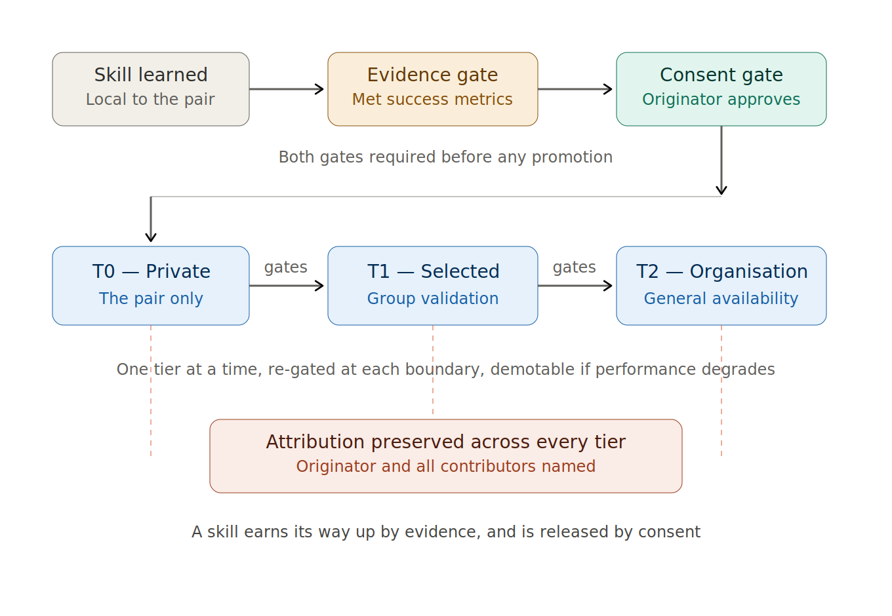

# Earned Promotion

**A governance pattern for consent-gated, validation-gated, attribution-preserving sharing of locally-learned agent skills.**

Author: Dr. Sean MacNiven
Affiliation: Coded for Humans
First published: 2026 · v0.1 (draft)
License: MIT

---

## Abstract

Personal AI agents increasingly learn from the individuals they work alongside, accumulating skills — reusable prompts, decision procedures, workflow captures — that are shaped by one person's working history. This creates a tension. The learning is valuable to the wider organisation, but the data it is derived from is personal, and centralising it raises privacy, consent, and regulatory concerns. The dominant technical response, federated learning, resolves half of this tension: it keeps raw data local and shares only model updates. But in its standard form federated learning **aggregates automatically** — updates flow to a global model by design, without the originating human deciding whether, when, or to whom their learning propagates, and without preserving who contributed what.

Earned Promotion is a governance pattern for the other half of the tension. A skill learned locally does not propagate automatically. It propagates only when it has **earned** promotion on two independent gates: an **evidence gate** (it has met defined success metrics over sufficient trials) and a **consent gate** (its human originator has chosen to share it, and with whom). Promotion proceeds through explicit tiers — private to the human-agent pair, then to selected individuals or groups, then organisation-wide — and **attribution is preserved at every tier**, so a skill that reaches the whole organisation still carries the name of its originator and every subsequent contributor.

The contribution claimed here is narrow and specific. Local-evolution / privacy-preserving skill-sharing for agents is an active research area with substantial prior art (see Prior Art). The element that is under-precedented is the **governance layer**: promotion gated jointly by measured evidence and human consent, advancing through named visibility tiers, with provenance carried throughout. This is a design pattern and a vocabulary, not a validated system or a new learning algorithm.

---

## The Problem

A personal agent that learns from one person produces skills that are simultaneously (a) organisationally valuable and (b) derived from personal behavioural data. Three failure modes follow from mishandling this:

1. **Hoard.** Keep everything local and nothing is ever shared; the organisation never benefits from individual learning.
2. **Harvest.** Centralise everything automatically and the privacy, consent, and regulatory problems that motivated local learning in the first place return in full.
3. **Strip.** Share the learning but detach it from its origin; contributors are not credited, which removes the incentive to contribute well and erases the provenance needed for trust and audit.

Standard federated learning addresses Harvest's *data* problem — raw data stays local — but its automatic aggregation does not address consent (the human does not choose), granularity of sharing (it is global by default), or attribution (updates are anonymised into a global model). Earned Promotion targets exactly these gaps.

---

## The Pattern

### Unit of sharing: the skill

The unit that propagates is a **skill** — a self-contained, reusable artefact (a prompt, a procedure, a crystallised workflow) with a defined input/output contract and an attached record of how it has performed. Earned Promotion federates *artefacts*, not model parameters. This is a deliberate choice: artefacts are inspectable, attributable, and consent-able in a way that gradient updates are not.

### Two independent gates

A skill is promoted only when **both** gates pass:

**Evidence gate.** The skill has been applied over a sufficient number of trials and has met pre-defined success metrics. Until it does, it cannot be offered for promotion regardless of consent. This prevents an enthusiastic originator from propagating an unproven skill.

**Consent gate.** The human originator is asked whether to promote, and to which tier. Until they agree, the skill cannot propagate regardless of evidence. This keeps the human in control of their own learning and prevents the organisation from harvesting by default.

The two gates are independent and both necessary. Evidence without consent is harvesting; consent without evidence is noise.

### Promotion tiers

Promotion is not binary (private/global) but graduated through named visibility tiers:

| Tier | Visible to | Typical purpose |
|---|---|---|
| **T0 — Private** | The human-agent pair only | Local learning and refinement |
| **T1 — Selected** | Named individuals, a group, or a team | Additional testing and validation by trusted peers |
| **T2 — Organisation** | Everyone in the organisation | General availability |

A skill advances one tier at a time, re-passing both gates at each boundary. A skill validated by its originator (T0→T1) may be further validated by the selected group before organisation-wide promotion (T1→T2). Promotion is reversible: a skill may be demoted if its measured performance degrades.





### Attribution carried throughout

Every promotion preserves provenance. A skill published organisation-wide names its originator and lists every contributor who refined it at intermediate tiers. Attribution is a first-class property of the artefact, not metadata that can be stripped on promotion. This serves three ends: it incentivises high-quality contribution, it provides the audit trail regulators and reviewers need, and it preserves the human authorship that the consent gate protects.

---

## What Earned Promotion Is Not

- **It is not standard federated learning.** Federated learning aggregates model updates automatically into a global model. Earned Promotion promotes inspectable artefacts, only on joint evidence-and-consent gates, through named tiers, with attribution preserved. It is a governance layer that could sit atop a federated system but does not require one.
- **It is not a learning algorithm.** It does not specify how skills are learned, only how they are permitted to propagate once learned.
- **It is not access control.** Access control governs who may *read* a fixed resource. Earned Promotion governs whether a learned artefact *propagates* to a wider tier at all, on evidence and consent, and tracks provenance as it does.
- **It is not automatic knowledge distillation.** Distillation compresses many models into one without human gating or attribution; Earned Promotion is human-gated and attribution-preserving by definition.

---

## Prior Art

The mechanisms Earned Promotion builds on have substantial and active prior art; honest engagement with it is the basis of the narrow contribution claim.

**Federated learning for LLM agents.** A growing 2024–2026 literature applies federated learning to agentic systems. *Fed-SE: Federated Self-Evolution for Privacy-Constrained Multi-Environment LLM Agents* (arXiv:2512.08870) proposes a local-evolution / global-aggregation paradigm for self-evolving agents under privacy constraints. *Federated In-Context LLM Agent Learning* (arXiv:2412.08054) shares agent experience across clients without exchanging private data. Surveys including *Federated Large Language Models: Current Progress and Future Directions* (arXiv:2409.15723) and *Toward Federated LLMs* (IEEE Communications Surveys & Tutorials, 2025) catalogue the field. The ICML 2025 CFAgentic workshop is devoted to collaborative and federated agentic workflows. What this literature shares is **automatic aggregation**: updates flow to a global model by design. None of these place the human originator at a consent gate, gate promotion on measured success metrics at the artefact level, advance through named visibility tiers, or preserve per-contributor attribution through promotion.

**Persistent / personal agent memory.** Work on persistent memory and user profiles for agents (e.g. arXiv:2510.07925; editable memory-graph personalisation, arXiv:2409.19401; the *Memory in the Age of AI Agents* survey and systems such as Mem0 and A-Mem) addresses how an agent accumulates and retrieves personal knowledge. This is the *source* of the skills Earned Promotion governs, not the governance of their propagation.

**Software release engineering.** The tiered, gated promotion idea has a clear analogue in staged software release (dev → staging → production) and feature-flag rollouts. Earned Promotion adapts that discipline to learned agent artefacts and adds the consent gate and attribution requirements that release pipelines do not have.

**Open-source contribution provenance.** Attribution-through-contribution echoes version-control authorship and open-source contribution graphs. Earned Promotion applies the same provenance principle to a tiered promotion process gated on evidence and consent.

The narrow contribution is the **integration**: joint evidence-and-consent gating of artefact promotion, through named visibility tiers, with attribution preserved throughout — the human-control and provenance layer that the automatic-aggregation literature does not provide.

---

## Relationship to Quipu Architecture

Earned Promotion is independent of, but composes cleanly with, [Quipu Architecture](https://github.com/seanmacniven75/quipu-architecture) (MacNiven, 2026; DOI 10.5281/zenodo.18941708). Where Quipu is an interaction architecture for presenting human-agent event streams, Earned Promotion is a governance pattern for propagating learned artefacts. When implemented together: a skill is a Quipu *crystallised skill* (Quipu Principle 6); its promotion across tiers is a *Quipu Bundle* operation over decision streams (Principle 8); and the evidence, consent, and promotion events sit as typed knots on the primary cord, making the whole promotion history auditable. Earned Promotion does not require Quipu, and Quipu does not require Earned Promotion; the two are layered, not merged.

---

## Limitations and Open Questions

This is a draft pattern, not a validated system.

- **No reference implementation yet.** The pattern is specified in prose; a minimal reference implementation of the two gates, the tier model, and the attribution record is future work.
- **Metric design is unspecified and hard.** The evidence gate is only as good as the success metrics chosen; poorly chosen metrics promote the wrong skills. The pattern deliberately does not prescribe metrics, which leaves the hardest part to the implementer.
- **Consent fatigue is a real risk.** Repeated promotion prompts may train humans to click through them, hollowing out the consent gate. The interaction design of the consent step is critical and unaddressed here.
- **Tier proliferation and demotion dynamics** at scale (when to demote, how to handle a skill that degrades only for some users) are not characterised.
- **Attribution at scale** (a skill refined by hundreds of contributors) needs a presentation and weighting model not specified here.

---

## Citation

If you use this pattern, please cite:

```
MacNiven, S. (2026). Earned Promotion: A governance pattern for consent-gated,
validation-gated, attribution-preserving sharing of locally-learned agent skills.
https://github.com/seanmacniven75/earned-promotion
```

```bibtex
@misc{macniven2026earnedpromotion,
  author = {MacNiven, Sean},
  title  = {Earned Promotion: A Governance Pattern for Consent-Gated, Validation-Gated, Attribution-Preserving Sharing of Locally-Learned Agent Skills},
  year   = {2026},
  publisher = {GitHub},
  url    = {https://github.com/seanmacniven75/earned-promotion}
}
```

---

*Contributions, critiques, and adversarial readings are welcomed via GitHub Issues.*
